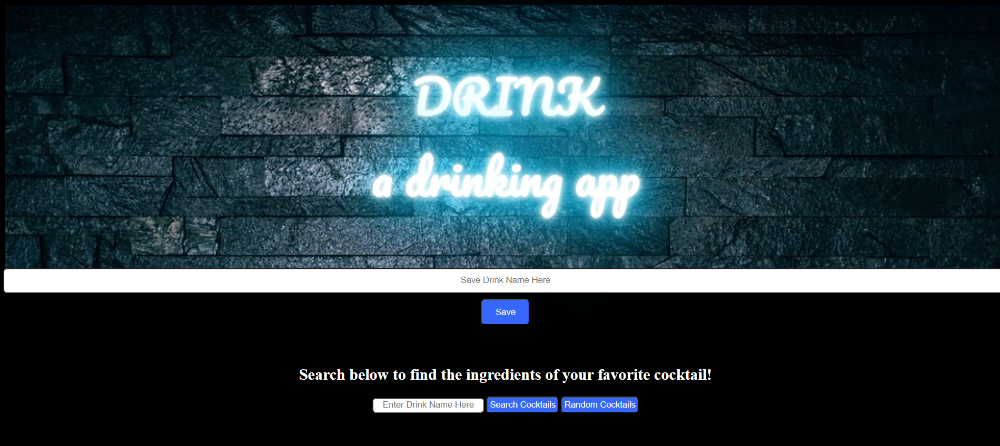
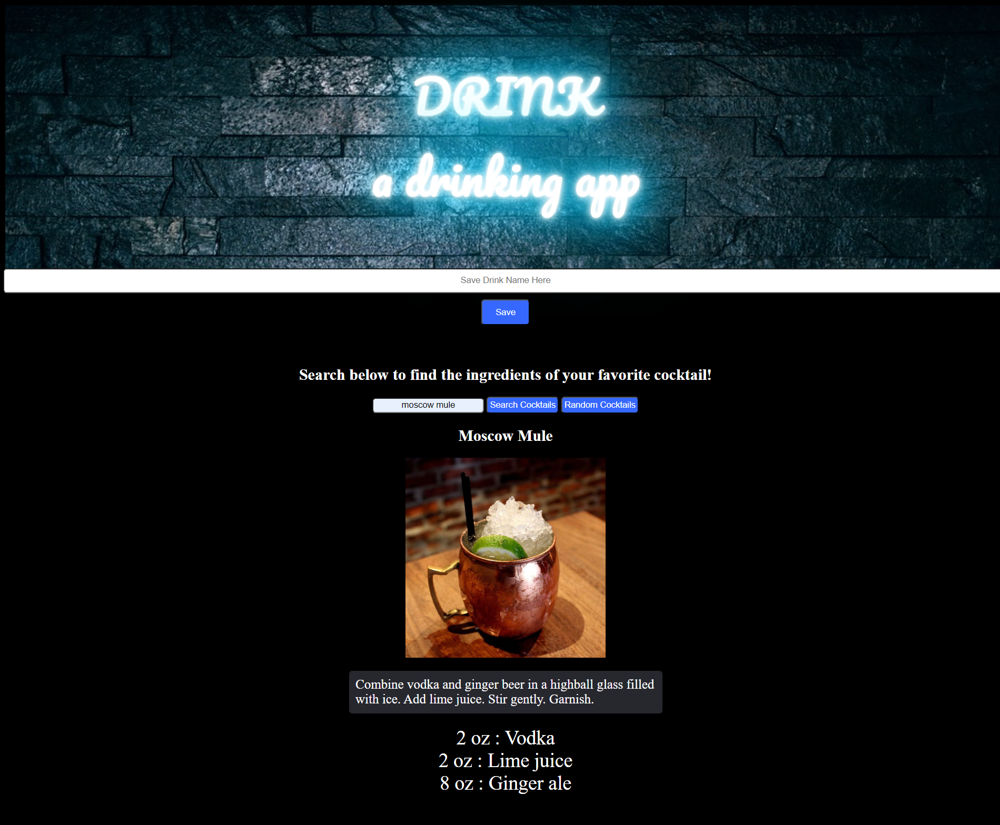
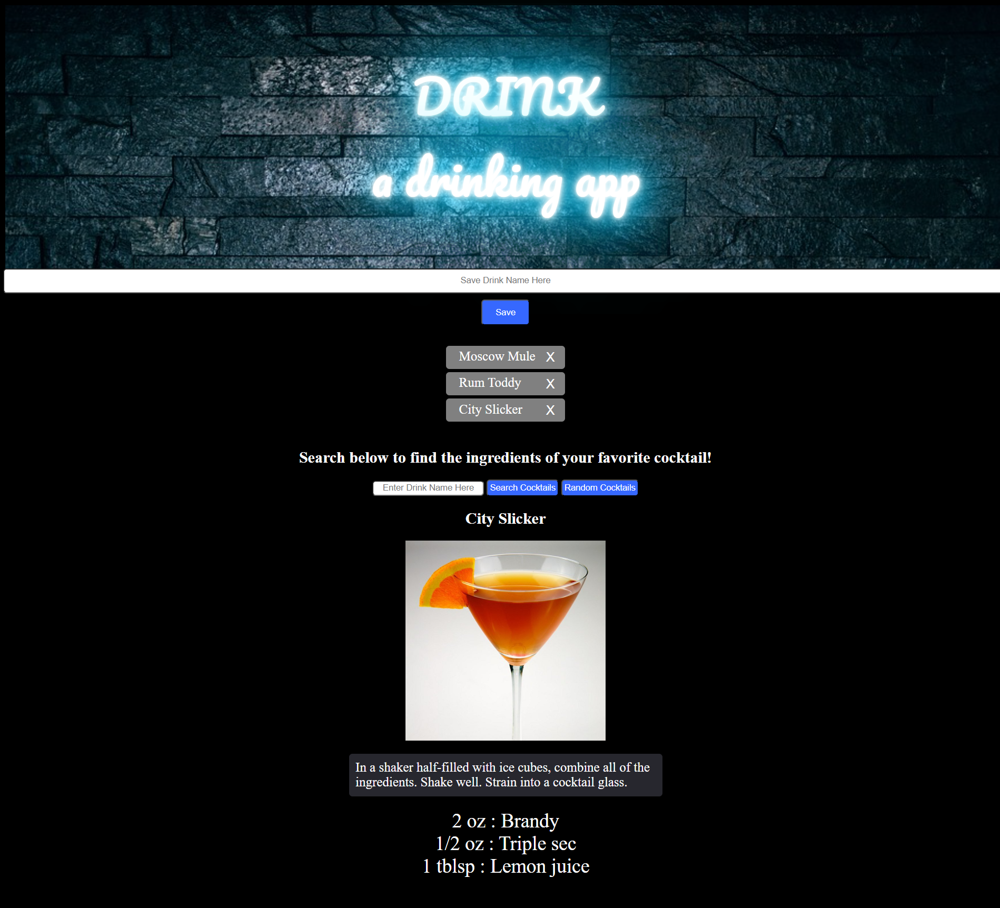

# drink2.0

## Discription 

This project was to create an original application that pulls in server-side APIs. In this app I used TheCocktailDB API to create a Drink Inquery Reasourse called DRINK©. DRINK© is a drinking app that allows users to record there favorite cocktails or beer and learn discriptions and or ingredients of there drink of choice. For example if a user is at a bar and orders a "moscow mule" and likes it. They can then type it in to there favorites list of drinks they like and use the cocktails database in the app to learn more. The cocktails database wil provide the user with the title of the drink, image of the drink, instructions or discription of the drink, and the ingredients of the drink. With this information the user can store the drinks they like to order in the future or even recreate at there own convenience.

## Mock-up

Landing Page

Search Drink By Name Functionality

Save Drink Name Functionality

## Deployment Links

- https://mrgreen12375.github.io/drink2.0/

- https://github.com/mrgreen12375/drink2.0